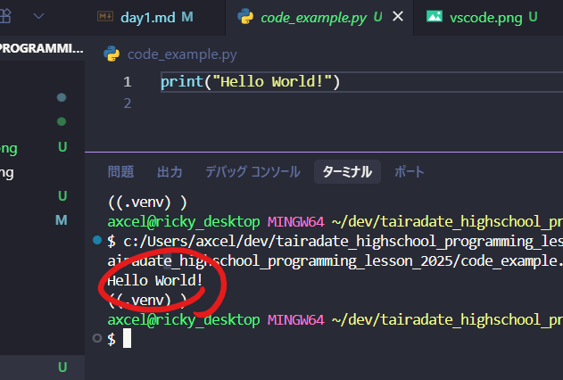

# day1 Pythonの基礎①

## 講師・アシスタント紹介

### 講師:吉田 力(リッキー)
<div style="display: flex; align-items: center; gap: 8px;">
8ackathon(ハッカソン)代表。プログラミング教室「アクセルキャンプ」代表。サルビアの向かい、雑貨屋HARENOHIのとなりのようわからんあそこでプログラミング教室とかやってる人。ゲームサークルとかマイクラ部とかやってるので、見かけたら声かけてね。</div><br>

### アシスタント① 大垣 ゆうき(ガッキー)
<div style="display: flex; align-items: center; gap: 8px;">

サルビアの向かい、雑貨屋HARENOHIのとなりのようわからんあそこでプログラミング教室とかやってる人。ゲームサークルとかマイクラ部とかやってるので、見かけたら声かけてね。
</div><br>

### アシスタント② 沖野 省吾(オッキー)
<div style="display: flex; align-items: center; gap: 8px;">

サルビアの向かい、雑貨屋HARENOHIのとなりのようわからんあそこでプログラミング教室とかやってる人。ゲームサークルとかマイクラ部とかやってるので、見かけたら声かけてね。
</div><br>

## 八幡平市起業志民プロジェクト「スパルタキャンプ」事業紹介

## プログラミングについて
  - ### プログラミングってなんだろう
    プログラミングは、コンピュータと人間がコミュニケーションを取るための手法のこと。
    人間同士でコミュニケーションを取る場合、言語や文字を用いて行うけど、それと同じで、人間がコンピュータにやってもらいたいことを伝えたりするときに『言語』を使う。
    でもちょっと困ったことに、コンピュータは基本的に『機械語(=マシン語)』という、数字の0と1(2進数)だけで表される言語でのみ、物事を理解するしくみになってる。流石に人間がその機械語で指示を出したりするのは大変だから、別の方法が必要になってくる。
    そこで活躍するのが『プログラミング言語』というやつ。コンピュータに指示をするときに、より人間にわかりやすく指示できるように設計されたプログラミング言語で指示を書き込んでいく。そうするとコンピュータは「コンパイル」という、プログラミング言語を機械語に変換(翻訳)する作業をはじめる。その結果コンピュータに理解できる形式になっていれば指示を実行して、もしそうでなければ警告(エラー)を出すなどして間違いを指摘したりしてくれるわけ。

    プログラミング言語は、世の中のいろんなところで使われています。
    ・コントローラーの右ボタンを押したらキャラを右に動かすという指示
    ・実際の室温にあわせてエアコンの温度調節をする指示
    ・スマホを見ただけで顔認証でログインする機能
    これら全てにプログラミング言語が使われています。

  - ### Python(パイソン)とは
    プログラミング言語にもいろんな種類があり、それぞれ得意な分野などがある。
    それぞれ似てるところもあれば違うところもあって、イメージで言えば日本語の方言みたいな感じ。
    - プログラミング言語いろいろ(パクり元:Gemini先生)
      | 言語名          | 得意分野                                                       |                                                        特徴                                                        |
      | :-------------- | :------------------------------------------------------------- | :----------------------------------------------------------------------------------------------------------------: |
      | **Python**      | **データ分析、機械学習、Web開発、自動化**                      |                  シンプルで読みやすい文法。豊富なライブラリがあり、多岐にわたる分野で活躍します。                  |
      | **JavaScript**  | **Webフロントエンド (ブラウザ操作)、Webバックエンド(Node.js)** | Webサイトに動きをつけたり、ユーザーインターフェースを構築するのに必須です。現在、最も汎用性が高い言語の一つです。  |
      | **Java**        | **大規模システム開発、Androidアプリ開発、エンタープライズ**    | 処理速度が速く、安定性に優れます。「一度書けばどこでも動く」という特徴があり、信頼性が求められる分野で使われます。 |
      | **C / C++**     | **OS、組み込みシステム、ゲーム開発、高性能計算**               |      実行速度が非常に速く、ハードウェアに近い低レベルな制御が可能です。処理速度が求められる分野で使われます。      |
      | **PHP**         | **Webバックエンド開発 (特にCMS、例: WordPress)**               |                    サーバーサイドのWeb開発に特化しており、手軽に動的なWebサイトを構築できます。                    |
      | **Swift**       | **iOS/macOSアプリ開発**                                        |  Apple製品（iPhone, iPad, Mac）向けのネイティブアプリ開発に使われる言語です。安全性が高く、モダンな設計で    す。  |
      
      
    Pythonは人間が話す英語に近い形で記述できて、初心者が学びやすい言語でありつつ、AI関連の開発やWebサイト制作などでめちゃくちゃ使われている言語なので、コレ一つ覚えれば大抵のことはできる(とはいえ、苦手なことも一応ある)って感じ。

## さっそくpythonを使ってみよう!
  と、その前に
  - ### pythonを書く=プログラミングをするための道具の紹介
    - **Visual Studio Code(ビジュアルスタジオコード：VSCocde)**: テキストエディタ
      例えば、こんな感じのながーいプログラムコードを書くのは、いくらプログラマーでもめちゃしんどい
      
      pythonが学びやすい言語だとはいえ、いきなりこんな意味わからんコード(プログラムの文字のこと)を打つのは正直しんどい。なので、コードの入力を助けてくれる便利ツールを使います。長～い文章を書くときに、パソコンがこれから書くことを予測して「これじゃね?」って候補を表示してくれたら便利だよね?感じの予測変換なんかは出てくるけど、VSCode(ブイエスコード)を使うと、そのプログラミング版の機能が使えて超便利。
      
      ①エクスプローラ：ファイルを整理して置くところ。ファイルの位置関係がわかりやすい
      ②エディター：コードを書くところ
      ③ターミナル：マイクラで言うところのコマンドを書くところ。何に使うかはのちほど
      <br>
      VSコードはこの3つの画面に別れていて、みんながコードを書くのは **①エディタ** の部分。ここにコードを書いて、右上の実行ボタンを押すと、下の「ターミナル」と言われる部分に結果が表示される。早速コードを打ち込んでみよう！
  
  - ### 文字を表示してみよう! Hello World!!
    エディタ部分に、このコードを記入してみよう
    ```python
    print("Hello World!")
    ```
    VSCodeの機能を使ってラクして書いてみよう。priと打ったあとにtabキーを押すと、「これじゃね?」ていうのが出てくるので、クリックまたはtabキーで選択（またはマウスで選択）しよう。これを「コード補完」といって、VSCodeがラクにコードをかけるように候補を出してくれてるので、ありがたく使わせていただこう。
    <br>

    かけたと思ったら、右上の **▷ボタン(実行ボタン)** を押してみよう。こんな感じの表示が出ればOK。
    <br>
    
    これでみんなは、pythonのコードを書いて、「Hello World!」という文字を表示させる、という処理を実行し、成功させたわけだ。
    これでみんなもプログラミングマスターだ!さあ、プログラミングの世界に羽ばたこう!!
    - #### なにそれ、ショボw
      そらそう。文字出すだけで何がおもろいねん。
      今やったのは、プログラミングの一番ベースとなるところで、最終的にはコードを使ってゲームを動かしたりできるようになるけど、最初はちょっとだけ地味めなことが続くので、がんばって。

  - ### pythonで計算してみよう
    問題:以下のコードを実行してください
    ```python
    print("1 + 2")
    ```
    明らかに計算してくれそうなコードだけど、答えはどうなった?
    1+2は1+2。そのとおり、やったね!

    って、あかんやん。3になってほしいのよ!
    ここで、pythonの文字と数字の扱いについて。
    - #### プログラミング=データをいかにして使うか: データ型
      プログラミングは、**データをいかにしてコネコネするか** といえる。さっきのHelloWorldのやつは、HelloWorldという **文字の**データを使ったわけだけど、今回は1と2という**数字の**データを使って計算したい。
      プログラミングは様々の種類(=**型**)のデータを扱うから、その型に応じた扱い方をしなくちゃいけない。まな板と包丁では、使う目的も使い方も違うよねって話。
      pythonのデータ型はたくさんあるけど、今回出てくるのは2種類だけ。
      - 文字列型(string型 / str型)
        文字列を使うときは、さっきHello Worldでやったみたいに、""(ダブルクオート)で囲う必要がある。
        さっきデータによって使い方を変えるって言ったけど、実は文字同士で足し算ができるんだけど、文字列の場合は文字同士がくっついて別の文字列になる。
        
      - 整数型(integer型 / int型)
        整数(小数じゃない数)を扱う型。文字列と違って""で囲う必要がない。数学と一緒で四則計算ができるけど、ちょっと特殊な計算方法もある。
    
      - まとめると
        | データ型の名前              |                             特徴                             |
        | :-------------------------- | :----------------------------------------------------------: |
        | 文字列型 / string型 / str型 |      文字を扱う<br> " " で囲う<br>足し算すると合体する       |
        | 整数型 / int型              | 整数(少数じゃない数)を扱う<br> " "で囲わない<br>計算ができる |
    
    - #### pythonの四則演算
      pythonで四則演算(足し算、引き算、掛け算、割り算)をしてみよう。
      掛け算・割り算の記号が算数とちょっと違うのと、割り算にいろんな種類があるのが特徴。

      | 演算子の記号 |       役割       | コード例             | 実行結果 |
      | :----------: | :--------------: | :------------------- | :------: |
      |    **+**     |      足し算      | ```print(10 + 5)```  |    15    |
      |    **-**     |      引き算      | ```print(20 - 7)```  |    13    |
      |    **\***    |      掛け算      | ```print(4 * 6)```   |    24    |
      |    **/**     |      割り算      | ```print(15 / 3)```  |   5.0    |
      |    **//**    |  割り算の**商**  | ```print(17 // 5)``` |    3     |
      |    **%**     | 割り算の**余り** | ```print(17 % 5)```  |    2     |
      |   **\*\***   |      べき乗      | ```print(2 ** 3)```  |    8     |
  - ### 変数につぃて
    例えば、こんなプログラムを作ることを想定してみよう。
      国語、数学、家庭科、化学、生物、物理、地学、日本史、世界史、音楽、情報、政治・経済、図工、道徳、家庭科、英語のテストの点数を見て、赤点の科目数を数えるプログラム
    こういうプログラムを作るときに、たとえば
    80点、50点、62点、91点、80点、23点。。。
    とかっていう点数を渡されても、どれがどの科目の点数なのかわかんないよね。
    プログラミングしてる時も同じで、計算したりするデータがなんのデータなのか、 **わかりやすく名前をつけてあげる** と超便利。
    pythonでは、こんな感じで **=** (イコール)を使ってデータに名前をつけます。
    ```python
      kokugo = 80
      suugaku = 50
      kateika = 62
      kagaku = 91
      ...
    ```
      ※プログラミングと算数・数学では、イコールの意味が違う!
      算数や数学で、イコールというと、「右と左は同じもの」という意味だけど(1+1=2)、プログラミングでは「右のデータを、左として登録するよ!」という意味になる!
      例えば、
      ```python
      kokugo = 80
      ```
      とすると、kokugoと80が同じという意味ではなく、「80という数字のデータを,変数『kokugo』として登録するよ!これ以降、kokugoといったら、数字の80のことね!」ていう意味になる。
    - #### 変数を使って計算してみよう
      変数を登録(宣言)すると、それ以降のコード内でその変数名を使うと、その登録されたデータのことを指すから、例えば、こういうことができる
      ```python
      kokugo = 80
      suugaku = 50

      print(kokugo + suugaku)
      ```
      実行結果:130

    - #### <練習問題>
      次の問題を、pythonで解いてみよう
      ```
      国語80点、数学50点、英語が70点として、この三教科の平均点を求めよ
      ```
      <details>
      <summary>解答例</summary>
      
      <pre><code class="language-python">
      kokugo = 80
      suugaku = 50
      eigo = 70
      heikin = (kokugo + suugaku + eigo) / 3
      print(heikin)
      </code></pre>
      </details>

  


