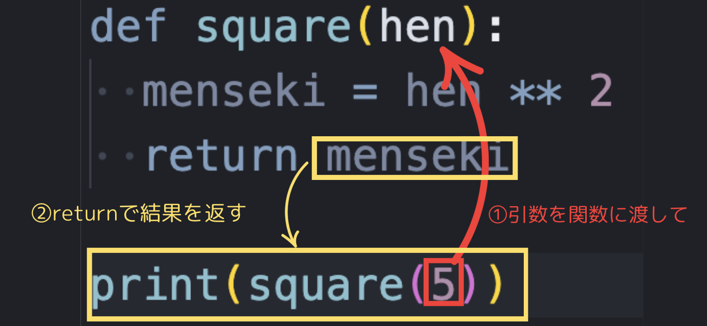

# day2 Pythonの基礎② / Pyxel入門

## Pythonの基礎文法②: 制御構文

プログラムは基本的に上から下に順番に実行されるけど、「もし〇〇だったら、この処理をする」「この処理を10回繰り返す」のように、**処理の流れ（制御）**を変えることができます。これを**制御構文**といいます。

### 1. 制御構文①: `<if>` もし〜なら (条件分岐)

例えば、エアコンの新機能を作るとする。室内を最適な温度に保ちたいわけだけど、いちいち温度設定をしたり、冷房と暖房を切り替えたりするがめんどくさい！ていう悩みを解決してみよう。

- プログラムを日本語で表現してみよう
  新しいプログラムを書き始めるときに、いきなりpythonのプログラムを書き始めるのもいいんだけど、複雑なプログラムを書くときはあんまりおすすめしない。例えば英語で手紙を書くときに、まず何を伝えたいかを日本語で頭の中で整理してから英語に直すと、文章を書いている間に余計なことを考えたりしなくてすむから、結果的に効率がいい、なんてことがある。
  今回作りがいコードはこんな感じ

  ```
  もし　外の気温が　２５度以上だったら
  　　「冷房オン」とprint
  そうじゃなくて　外の気温が　１０度以下だったら
  　　「暖房オン」とprint
  どっちでもなかったとき
  　　「電源オフ」とprint
  ```

***ここにif文のコード例を挿入***
- #### `if` = 「もし〜なら」

  ifを使った条件分岐の書き方はこんな感じ

  ```python
  if 条件:
      条件に合致する場合に実行したい処理
  ```

  - pythonコードとインデント
    ２行目の処理の部分の左側にある空白の部分を、「インデント」といって、入力するときはスペースキーではなく**tab**キーで入力できる。
    pythonの大きな特徴として、**決まったとおりにインデントしないと、エラーになったり、想定通りに動かない**という特徴がある（言語によっては動く言語もある）
    このif文の場合、「条件」に合致したときに実行したい処理はどの処理なのかを、インデントをすることで示しているわけ。たとえばこういう書き方をすると、三行目の処理は条件に関係なく実行される

    ```python
    if 条件:
        条件に合致する場合に実行したい処理
    条件に関係なく実行される処理
    ```

  今回の場合、この「条件」のところに「外の気温が　２５度以上だったら」が入るわけだけどその部分をどう書くかが問題。「２５」という指定された数字と、実際の外の気温を比較する必要がある。

  - #### 比較演算子

    算数・数学でいうところの第なり（＞）とか小なり（＜）のプログラミング版の書き方。

    | 比較演算子 | 意味                      |
    | :--------: | :------------------------ |
    |   **==**   | 等しい (イコールふたつ！) |
    |   **!=**   | 等しくない                |
    |   **>**    | より大きい                |
    |   **<**    | より小さい・未満          |
    |   **>=**   | 以上                      |
    |   **<=**   | 以下                      |

    これをpythonコードに落とし込んでみよう
    仮に、外の気温＝Outside_tempを、１８度とします。

    ```python
    outside_temp = 18

    ＃外の気温が２５度以上だったら「冷房オン」とprint
    if outside_temp >= 25:
        print("冷房")
    ```

    ※　コードの中の　#　で始まる行は「コメント」といって、プログラムには関係のない行として無視されます。どんな処理をしているかのメモを残したりするときに使います。

- #### `elif` と `else`

    複雑な条件分岐を書くときは、条件が２以上になる。今回の条件は

    ```
    ①外の気温が２５度以上
    ②外の気温が１０度以下
    ③　①②以外（１０度より高く、２５度未満）
    ```

    の３つ
    `elif` は、条件分岐のなかにいくつでも追加できる。２つめ、３つ目の条件を追加するときに追加するやつ
    `else` は、その上にあるどの条件にも合致しないときに実行する処理を書くときにつかうやつ。他の２つと違ってこの場合は条件を書く必要がない
    elif elseを使うバージョンの条件分岐の書き方はこんな感じ。

    ```python
    if 条件①:
        条件①に合致する場合に実行したい処理
    elif 条件②
        条件②に合致する場合に実行したい処理
    elif 条件③
        条件③に合致する場合に実行したい処理
    ・・・
    else:
        今までのどの条件に合致しなかったときに実行したい処理
    ```

    これを使って、エアコンプログラムを完成させてみよう

    ```python
    outside_temp = 18

    # 外の気温が２５度以上だったら「冷房オン」とprint
    if outside_temp >= 25:
        print("冷房オン")
    # 外の気温が１０度以下だったら「暖房オン」とprint
    else outside_temp <= 10:
        print("暖房オン")
    # そのどちらでもなかったときに「電源オフ」とprint
    else:
        print("電源オフ")
    ```

### 2. 制御構文②: `<for>` 回数指定の繰り返し

コードを書くときのとても重要な考え方として、「コードをわかりやすく、短くまとめる」というのがある。
真夏の体育館での校長先生の話を考えてみよう。５分ですむ話を、１時間も２時間もされたら、たまったもんじゃないよね。でも大体校長先生の話とかって「挨拶をしようね」「礼儀正しくしようね」ってだけの内容無事が多い（気がするｗ）
プログラミングをしていくうえで、「おんなじことを何回も繰り返し実行したい」っていうシーンは結構ある。例えば

- クラスの全員に対して個別でLINEを送りたい（＝クラウの人数分繰り返しLINEを送る）
- 右ボタンが押されている限り繰り返しキャラクターを右に移動させたい

１つ目のLINEの例を考えてみよう。

たとえばクラスが１００人いたときに、コードはこんな感じ（実際にはlineを送る処理はもっと複雑だけど）

```
print("LINEを送信")
print("LINEを送信")
print("LINEを送信")
print("LINEを送信")
print("LINEを送信")
print("LINEを送信")
print("LINEを送信")
print("LINEを送信")
・・・
# これを１００人分繰り返す
```

こんな感じで、**回数が決まっている**（今回は１００回）繰り返しのは、pythonではこう書きます。

```python
for i in range(繰り返し回数):
    繰り返し実行したい処理
```

これをもとに、さっきのLINE送信プログラムを書いてみると

```python
for i in range(100):
    print("LINEを送信")
```

<details open markdown="1">
<summary>　参考：i とか range とかって何なのよ</summary>
このコードを動かしてみよう
```python
for i in range(10):
    print(i)
```

実行結果↓

```
0
1
2
3
...(省略)
10
```

range(10)とすると、０から９までの数字データのかたまり（配列といいます）が入って、for文といっしょに使うことで、処理中にその塊に入っているデータに順番にアクセスしていく感じ。０から９だから、全部で１０回の繰り返しになる、てこと。iという文字に、繰り返しごとにデータが順番に入っていく感じ。ここの文字は別にiである必要はなくて、自由に名前をつけられる。
配列には他にも「リスト」などの種類があって、こっちは数字だけじゃなくて文字も扱える。
配列を使った繰り返しの例はこんな感じ
```python
teacher_list = ["リッキー", "オッキー", "ガッキー"]
for teacher in teacher_list:
    print(i + "かっこいい")
```
実行結果↓
```
リッキーかっこいい
オッキーかっこいい
ガッキーかっこいい
```
</details>

### 3. 制御構文③: `<while>` 条件指定の繰り返し

for文は回数指定の繰り返しだけど、例えばこんなとき、何回繰り返すことになるかわかんないよね
・気温が３０度以上である限りスプリンクラーを巻き続ける
・「おわり」と指示するまで仕事をやめないロボット
・「君がッ 泣くまで 殴るのをやめないッ」
これらは回数じゃなくて**条件**によって繰り返すかどうかを制御する必要がある。
while文の繰り返しの書き方はこんな感じ

```python
while 繰り返すときの条件:
    繰り返したい処理
```

試しに、「君がッ 泣くまで 殴るのをやめないッ」を、pythonで実装してみよう。
inputという特殊な関数を使って、ユーザーが文字を入力して、「ぴえん」という文字を入力したときだけ処理が終了して許してもらえるというプログラム。

```python
dio = ""
while dio != "ぴえん":
    print("オラ!")
    dio = input("dio:")
print("ゆるしてやろう")
```

ここでもインデントが重要で、インデントされている2つの処理が繰り返し実行される処理、インデントされていない print("ゆるしてやろう") の部分は、繰り返し=while文が終了したあとに実行されることがわかる。

<details>
<summary>
参考①True(トゥルー)とFalse(フォルス)
</summary>
試しにこのコードを実行してみよう。
<pre><code class='language-python'>
ricky = "かっこいい"
print(ricky == "かっこいい")</code>
</pre>

実行結果
<code>True</code>
True : 正しい
pythonも認めざるを得ないかっこよさ。
冗談はさておき、これは `ricky という変数と "かっこいい" という文字データは同じ` という条件が「正しい」ので、Trueという結果が帰ってきている感じ。
逆に
<pre>
<code class='language-python'>
ricky = "かっこいい"
print(ricky == "ブサイク")
</code>
</pre>
コレを実行してみると
<code>False</code>
という結果がでます。(False=フォルス:間違い)


今まで出てきたif文やwhile文は、「条件」が「TrueかFalseか」を判定しているわけ。例えば
<pre>
<code class='language-python'>
if ricky == "イケメン":
    print("わかるー")
</code>
</pre>
というif文は、`ricky == "イケメン`という条件がTrueのときに「わかるー」とprintする、という感じになる。ちなみに、パソコン内部的にはTrueは1、Falseは0として扱われるので、最初に出てきた「パソコンは0と1だけでデータを処理している」っていう話とつながってきたりする。試しにこのコードを実行すると、「おんなじ!」と出力される。
<pre>
<code class='language-python'>
if (True == 1):
    print("おんなじ!")</code>
</pre>
</details>

<details>
<summary>参考②無限ループ</summary>
ゲームが起動中にずーっと同じ処理を繰り返したい場合などによく使われる手法で、無限ループというのがある。たとえばこんなコード(実行する場合は、必ず近くに詳しい人がいるときにやってください。やりすぎるとパソコンに余計な負担をかけてしまうことがあります。)
<pre>
<code class='language-python'>
while True:
    print("リッキーかっこいい")</code>
</pre>
無限にリッキーかっこいいとprintするという非常に正しいコードになってる。
ループを抜けたい場合はCtrl + C で終了できる。

</details>


## 関数: 処理をまとめよう

プログラムを書いていくうえで、おんなじ処理を何回も実行したいときがあって、その一つの解決方法がforやwhile何だけど、もう一つのやり方がこの関数。
関数の基本の考え方は、`何度も使いそうな処理を一箇所にまとめておいて、使いたいときに処理を呼び出す`というやり方。
以下のコードは、for文などの繰り返しと違うところは、回数や条件を指定できない代わりに、`引数`というシステムを使うと、同じ処理を繰り返すだけではなく、`同じ「ような」`処理を繰り返し行うことができる。書き方の説明の前に、実際に関数をつかって書かれたコードを見てみよう、
以下の２つのコードは、どちらも正方形の面積を求めるプログラム何だけど、違いを見てみよう。
- ### パターン①：引数を使わないパターン
  <pre>
  <code class='language-python'>
  def square():
    hen_length = 5
    menseki = hen_length ** 2
    return menseki
  
  print(square())
  print(square())
  print(square())</code>
  </pre>
  このコードを実行すると、こんな感じで、print(square())を実行するたびに一辺の長さが５の正方形の面積を求めることができるぜ！なんて便利な関数なんだ！
  <pre>
  <code class='language-python'>
  25
  25
  25</code>
  </pre>

- ### パターン②：引数を使うパターン
  続いて、引数を使うパターンがこっち
  <pre>
  <code class='language-python'>
  def square(hen):
    menseki = hen ** 2
    return menseki
  
  print(square(5))
  print(square(6))
  print(square(7))</code>
  </pre>
  実行すると、それぞれ１辺が５，６，７の正方形の面積をprintしていることがわかる。これで、**同じ処理を、条件を変えて**実行することができるようになったわけだ
  

- ### 引数と戻り値のイメージ
  処理をするのに必要で、関数に与えるデータのことを**引数**、処理した結果返ってくるデータを **戻り値（返り値と言ったりもする）** という。
  データの流れを図で追ってみるとこんな感じ。
  

  <table>
      <tr>
          <td><b>機能</b></td>
          <td><b>役割</b></td>
      </tr>
      <tr>
          <td>引数</td>
          <td>関数にわたすデータ</td>
      </tr>
      <tr>
          <td>戻り値</td>
          <td>関数から返ってくるデータ</td>
      </tr>


  </table>


---

## 💻 練習問題: CLIアプリを作ろう

### <練習問題④> 挨拶アプリ

引数で受け取った**名前**を使って、「〇〇さん、おはようございます！」と表示する**関数**を作ってみましょう。

<details>
<summary>解答例</summary>

***ここに練習問題④の解答コードを挿入***

</details>

### <練習問題⑤> 点数判定アプリ

引数で**点数**を受け取り、以下のルールで評価を出力するアプリを **`if`文** を使って作成してください。

- 80点以上: 「優」
- 60点以上80点未満: 「良」
- それ以外: 「可」

<details>
<summary>解答例</summary>

***ここに練習問題⑤の解答コードを挿入***

</details>

---

## 🎮 ゲーム開発エンジン Pyxel (ピクセル)入門

今日学んだ内容を土台に、いよいよゲーム開発の第一歩を踏み出します！

### Pyxelでできること

- **レトロゲーム風のゲーム**を簡単に作れるPythonライブラリ（機能集）です。
- **16色パレット**や**ドット絵**、**レトロな音**など、昔のゲーム機のような雰囲気が出せます。
- Pythonのコードを書くだけで、グラフィックやサウンドの難しい設定なしにゲームが作れます。

### Pyxelの基本の流れ

Pyxelでゲームを作るには、基本的に以下の3つの処理を実装します。

| 処理           | 役割           | 実行されるタイミング                                    |
| :------------- | :------------- | :------------------------------------------------------ |
| **`init()`**   | **初期化処理** | プログラムの**開始時**に**一度だけ**実行される          |
| **`update()`** | **更新処理**   | **1秒間に30回 (30 FPS)** 実行され、データの更新を行う   |
| **`draw()`**   | **描画処理**   | **1秒間に30回 (30 FPS)** 実行され、画面に図形や絵を描く |

### Pyxelで図形を表示しよう

まずは最も基本的な図形である「**四角形**」と「**円**」を表示してみましょう。

- **`pyxel.rect(x, y, w, h, col)`**: 四角形を描画します。
  - `x`, `y`: 左上の座標
  - `w`, `h`: 幅と高さ
  - `col`: 色（0〜15の数字で指定）
- **`pyxel.circ(x, y, r, col)`**: 円を描画します。
  - `x`, `y`: 中心点の座標
  - `r`: 半径
  - `col`: 色（0〜15の数字で指定）

***ここにPyxelの図形描画コード例を挿入***

- **実行するには？**: このコードを `app.py` などのファイル名で保存し、ターミナルで `python app.py` と実行します。

これで、ゲーム開発の第一歩として、画面に色付きの図形を表示することができました！

---

## 🏡 おまけ

自宅のPCにPyxelをインストールして、試してみよう！

- **Pyxelのインストール方法**: ターミナルで以下のコマンドを実行
    `pip install pyxel`
- もしインストールでエラーが出たら、Pythonのバージョンが古い可能性があります。リッキーたちに聞いてください。

---

今日は**処理の流れ（制御構文）**と**関数**、そして**Pyxelでの図形描画**を学びました。明日はPyxelを使って、キーボードの操作に合わせて図形を動かす処理に挑戦します！
