# Pyxelでお絵かきしよう
前回まではpythonのプログラミングの話がメインだったけど、今回はゲーム制作に使うキャラクターのデザイン制作の話をしていくよ。自分の作ったキャラクターが実際に動くところを見ると、だんだんモチベも上がって行くので、プログラミングの学習にもつながっていくね。

## ゲームエンジンとは
みんなが遊んでるゲームで、起動画面とかで、こういう画面見たことない？
<br>

<br>

<br>
実はこれ、「こういう名前のゲーム開発エンジンを使って開発したよ！」ていうマークなんだよね。で、ゲーム開発エンジンって何かってことだけど、簡単に言うと「ゲームに必要な要素が詰まった開発環境」のこと。
例えば、ＦＰＳ（一人称視点シューティング：自分の目線で銃を撃ったりするやつ）のゲームを作ったときに、シューティングの部分だったり、弾の弾道計算なんかはプログラミングでできるけど、ゲーム用のマップを作ったり、マップに生えている草木なんかのオブジェクトをイチから作っていると、時間がいくらあっても足りないよね。
ゲーム開発エンジンには、そういう細かいところの開発を助けてくれて、メインのプログラミングでの開発に集中しやすくしてくれる効果があるよ。
ゲーム開発エンジンにもいろいろあって、バリバリのきれいな３ｄグラフィックを扱うのが得意なエンジンや、スマホゲームを開発するのが得意なエンジンなど、いろいろ。大きなゲーム開発会社だと、独自のゲーム開発エンジンを作っているところもあるくらい。

## レトロゲーム。２Ｄゲーム開発エンジン「Pyxel」

そもそもレトロゲームってなんだよ、ていう話だけど、みなさんファミコンとかって聞いたことある？
<br>
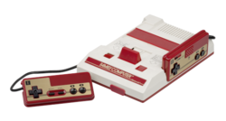
<br>
ファミリーコンピューターっていって、リッキーが幼稚園くらいにはまだ普通に遊ばれてたゲーム機。遊ばれてたゲームがどんなだったかっていうと
こんなのとか
<br>
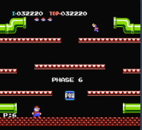
<br>
こんなのとか
<br>
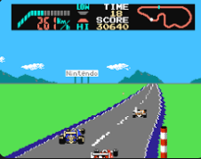
<br>
なんか、全体的に四角いｗでも、↑みたいな画像で、ちゃんと車が右奥の方向に進んでるのを表現するのって、すごくない？？
ピクセルという単位があって、絵やグラフィックを表すための四角いマスのことで、このピクセルが小さければ小さいほど、きれいなグラフィックが表現できるんだけど、当時はそのピクセルが現代と比べるととっても大きくて、めちゃくちゃ大きい点を使って、いかにキャラクターなどの絵を表現するかと言うのが、すごく難しかったわけ。

<br>
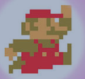
<br>
このマリオがもう現在ときたら、 
<br>
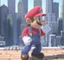
<br>
こうなっちゃうんだから、すごいよね！

## レトロゲームの魅力
リッキーがゲームをしていた頃は、ゲームのグラフィック面での進化がすごくて、グラフィックがきれいなゲーム = 新しいゲーム = 良いゲーム、みたいなところがあった気がする。実際、ファミコンが出て、スーパーファミコンが出て、プレステが１，２、３と出ていくにつれて、ものすごい勢いでグラフィックの技術が進歩していった。ファイナルファンタジー（通称ＦＦ）っていうＲＰＧがあるんだけど、リッキーが小学生のときこうだったのが（↓FF5）
<br>
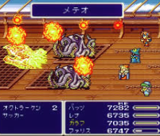
<br>
中学生の時プレステ２がでて、こうなったのはマジでぶったまげた(FF10)
<br>
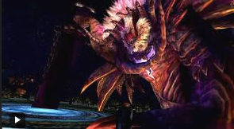
<br>

でも、nintendoストアとかsteamとかのゲームストアで、よく昔のゲームのリマスター版が販売されてたりするよね。あと、めちゃくちゃ技術が進歩している中で、マイクラやロブロックスみたいなシンプルなグラフィックのゲームが世界中で流行ったり、アンダーテイルなんていうド直球な２Ｄゲームが５００万本売れたりしてる。
<br>
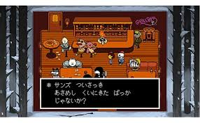
<br>

これってつまり、ゲームの面白さはグラフィックだけじゃないってこと。ゲームシステムだったり、音楽だったり、演出だったり、いろんな要素が関係しているってこと。アイディア次第ですんごいゲームが作れちゃうってこと。実際昔のゲームをあそんでみると、技術的な制限がある中で超天才的なアイディアとセンスで作ってるのが感じられることがあるよ！ぜひやってみてね

  - ### <参考>スマブラ生みの親・桜井政博さんのYoutubeチャンネル「桜井政博のゲームを作るには」
    ゲームクリエイターの桜井政博さんが運営しているYoutubeチャンネルで、ゲーム制作の話やスマブラなどの制作秘話みたいな情報がもりだくさん！とっても面白い話が聞けるチャンネルなので、ぜひ見てみてね！
    桜井政博のゲームを作るには(https://www.youtube.com/@sora_sakurai_jp)

# Pyxelとは

「かんたんに・楽しく」ゲーム開発ができるように作られた、2Dゲーム開発専用のライブラリがpyxel.シンプルなpythonコードでアイディアをゲームに実装できるようになっている。
コーディング以外でも、ドット絵（レトロゲーム用の絵）を描けるツールが用意されていたり
<br>
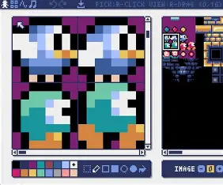
<br>
レトロゲーム風音楽を作成できるツールがあったり
<br>
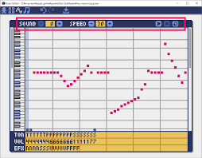
<br>
いろいろ便利な機能がついている！

# 黒い画面を出してみよう
pyxel_traininigディレクトリの中に、pythonファイルを作成するよ。はじめてpyxelを実行するので、first_pyxel.pyとしよう。
```bash
touch first_pyxel.py
```

まずはとにもかくにも、ゲームの画面（枠）を出すコードを、そのまま打ち込んでみよう。
```python
import pyxel

pyxel.init(160, 120, title="pyxel training")
pyxel.show()
```
実行してみて黒い画面が表示されたらOK!
<br>
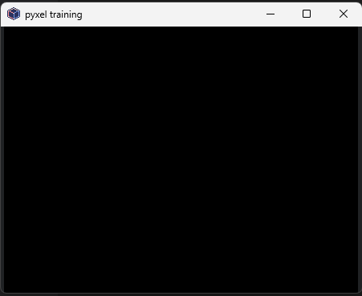
<br>

３行しかないので、それぞれに書かれていることを整理してみよう。
- ### 1行目：import pyxel
  これは[ライブラリ](../../1_library/1_library/library.html)のページでやったように、pip install でインストールしたライブラリを、pythonコード内で使えるようにするよ！という意味。
- ### 2行目：pyxel.init(160, 120, title="pyxel training")
  このinit関数は、pyxelを使うときに必ず書かなくちゃいけないやつなんだけど、第一引数、第ニ引数の数字が何を意味しているか、想像できるかな？そう、画面の大きさを指定しているんだよね。
  つまりこの関数は
  ```python
  pyxel.init(画面の横幅, 画面の縦幅, title="ゲームのタイトル")
  ```
  って感じ。
  - #### ＜参考＞アスペクト比について
    みんなが遊んでるゲーム機やモニターの画面って、正方形じゃないよね。大体の画面は横長にできていて、その横：縦の比率は４：３や１６：９が多い。この比率をアスペクト比っていうんだけど、将来YouTuberになって動画編集をしたかったり、開発したゲームをみんなに遊んでもらいたい、ってなったときに、間違ったアスペクト比で作ってしまうと、ゲームの端っこのアイテムが表示されなかったりして、思わぬところでうまくいかなかったりするから、今のうちから意識しとくといいかも！

- ### 3行目：pyxel.show()
  pyxel.show()は、画面を表示するための関数。これが実行されると、excapeキーが押されるまでpyxelの処理が止まるよ。今回はアニメーションを作るわけじゃないからshow()を使うけど、ゲームに動きをつけたいときは別の関数を使うのでお楽しみに。

とりあえず画面を表示できたけど、まだ画面内に何かを表示する処理を書いてないので、真っ黒な画面が出ているだけ。

# pyxelでお絵かきしよう①　図形を描画してみよう

pyxelには線を引いたり、四角や三角などの図形を描いたりする関数が用意されているから、早速使ってお絵かきしていこう！

と言いたいところだけど、その前にちょっと説明しときたいことがあるからちょっと待って！

- ### ｘ座標・ｙ座標 画面内での位置を指定する方法
  中学校に進んで算数が数学になるとすぐ、座標というのが出てくる。小学校でも習う「グラフ」に近い考え方だね。算数として勉強すると難しい座標も、プログラミングでイメージを掴んでおくとわかりやすかったりするよ！
  画面の一番左上の点をｘ座標 = 0,ｙ座標 = 0として、右に行くほどｘ座標が増えていって、下に下がるほどｙ座標が増えていく仕組みを使って、位置を表すことができる。これによって、たとえば画面上に直線を引きたいときに、「どこから」「どこまで」の直線を引くかを指定することができるよ
  <br>
  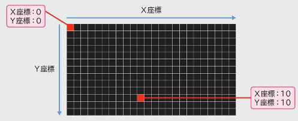
  <br>

- ### pyxelでの色の使い方
  pyxelでは、デフォルトでは指定された１６色の色だけを使うことができる（それ以外の色を使う方法もあるんだけど、また後ほど。）
  それぞれの色には０から１５までの番号が振ってあって、その番号を指定して色を出す仕組みになってるよ
  <br>
  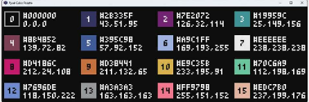
  <br>
  「え？１６色だけ？」って思ったそこのアナタ！余談だけど、昔のゲームボーイとかは、４段階の濃さの黒（無色・薄い・ちょっと濃い・濃い）の２色だけで、ポケモン（当時は１５１匹）を表現して描き分けていたって思うと、ヤバくない？
  <br>
  
  <br>

前置きが長くなったので、そろそろpyxelでお絵かきしようか！
まず手始めに、直線を描画（びょうが）してみようか！（画面上に出すことを、描画といいます）
画面を表示したあとに線を引いても、その線は反映されないので、線を引く関数はshow()関数の前に書くよ！

```python
import pyxel

pyxel.init(160, 120, title="pyxel training")

# (10, 20)の座標から（80, 20）まで,赤色（8番）の線を引く
pyxel.line(10, 20, 80, 20, 8)

pyxel.show()


```
実行するとこんな感じ！
<br>
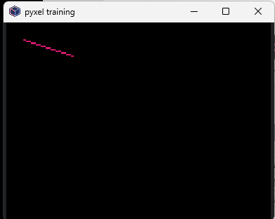
<br>

線を引く以外にも、描画をする関数がたくさんあるよ！コードにコメントと一緒に書いておくから、試してみたい関数を書いてみよう。引数をアレンジして、色を変えたり、サイズを変更したりしてみよう。

```python
import pyxel

pyxel.init(160, 120, title="pyxel training")

# 線を引く：（始点のｘ, 始点のｙ, 終点のｘ, 終点のｙ, 色番号 ）
pyxel.line(10, 20, 80, 20, 8)

# 点をうつ：（ｘ, y, 色番号）
pyxel.pset(10, 10, 7)

# 円を描画（中心のｘ, 中心のｙ, 半径, 色番号）
pyxel.circ(20, 50, 10, 11)

# 円の枠（円周）を描画：（中心のｘ, 中心のｙ, 半径, 色番号）
pyxel.circb(50, 50, 10, 11)

# 四角を描画：（左上のｘ, 左上のy, 幅, 高さ, 色番号）
pyxel.rect(10, 80, 20, 10, 13)

# 四角の枠を描画：（左上のｘ, 左上のy, 幅, 高さ, 色番号）
pyxel.rectb(40, 80, 20, 10, 13)

# 三角形を描画：（点１のx, 点１のy, 点２のx, 点２のｙ, 点３のx, 点３のｙ, 色番号）
pyxel.tri(80, 40, 80, 60, 100, 60, 15)

# 三角形の枠を描画：（点１のx, 点１のy, 点２のx, 点２のｙ, 点３のx, 点３のｙ, 色番号）
pyxel.trib(120, 40, 120, 60, 140, 60, 15)

pyxel.show()
```

<br>

<br>

ちなみに、英語で
line = ライン：線
circle = サークル：円
rectangle = レクタングル：長方形
triangle = トライアングル：三角形
pyxelの関数名はこれらを短縮したもので、枠線の関数にbがついているのは、border(境界線・枠線)のb。

# 練習①
以下の条件で描画してみよう。必要な計算はすべてpythonで計算する（自分で計算しない）こと。
```
画面の端から１０ずつ離れたところから、画面の中心に向かって線を引く
```
<br>
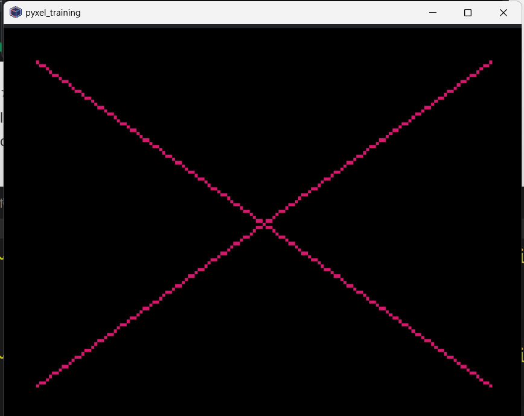</img>
<br>
<details>
  <summary>ヒント</summary>
  <p>変数を活用しよう</p>
</details>

# 練習②
以下の図形を描画してみよう
```
中心に２０ｘ２０の正方形の枠を書いて、そこから２ピクセルずつ大きい正方形を５つ描く
```
<br>
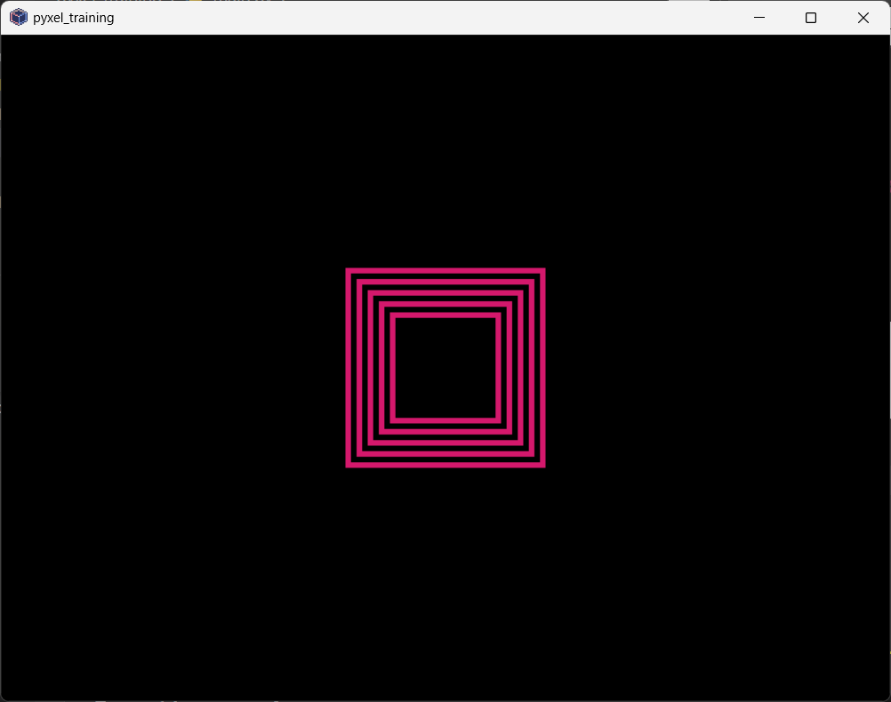</img>
<br>
<details>
  <summary>ヒント</summary>
  <p>おんなじことの繰り返し・・・ということは？</p>
</details>

# pyxelでお絵かきしよう②　キャラデザをしてみよう
四角や三角がプログラムで作成できるのはわかったけど、これだけでマリオみたいなキャラクターを描いたりするのは超大変。でも大丈夫、さっきも言った通り、pyxelにはお絵かきするためのツールが用意されているよ

みんなが知っているような大規模なゲームタイトルは、チームや組織で作ることがほとんど。みんな役割が決まっていて、プログラミングをする人や、キャラデザを考える人、アニメーションをつくる人、音楽をつくる人、販売をする人、広告をつくる人・・・ほんとにいろんな人がゲームに関わって、みんなの元に届いています。

個人でゲームを開発するとなると、基本的にそれらを一人でやらくちゃいけないけど、逆にいうと全部を自分の思い通りにできる！その意味では、ゲーム作りの醍醐味とも言えるよね。

絵のが不得意だったり、音楽なんて作ったことないし、という不安もあると思う。でも大丈夫。Pyxelはそういう人でも絵を書いたり音楽が作れるツールを用意してくれているし、何よりドット絵や１６bitの音しか使えなくて、アイディア次第でいろんな絵や音楽が作れるよ！


## pyxel Editorとは
pyxel editorは、pyxelのゲーム制作で必要になる画像や音楽を自分で作れるツール。Pyxelライブラリに標準で搭載されていて、Pyxel上で絵を書いたり、背景を描いたり、音楽や効果音を作ることができるよ！

## pyxel editor の使い方

- ### Pyxel Editorの起動方法
  PyxelEditor を使うためには、pyxres(パイグレス。。。って読むと思うｗ)という拡張子のファイルを作る必要があるよ。このpyxresファイルには、作成した音楽や画像の情報が入っていて、使いたいときにそれぞれのファイル名を指定して、その中の画像の１番、効果音の２番を使う！というように指定するよ。

  以下のコマンドで、指定したファイル名をもとにpyxelエディタを開くよ。pyxresファイルがまだ作成されていない場合は、指定した場所（パス）に児童でpyxresファイルが作成されるよ。

  ```bash
  pyxeleditor ＜指定のパス＞
  ```

  例えば、こんな感じのフォルダになっていたときに、

  こういうパスを指定すると
  ```
  pyxeleditor character
  ```
  こんな感じで、character.pyxres というファイルができていればOK
  <br>


- ### Pyxel Editor の画面について
  pyxel editorには次の４つの機能があるよ
  
  <table>
      <tr>
          <td>
            イメージエディタ
          </td>
          <td>
            キャラクターなどのパーツとしての絵を作成できる
          </td>
      </tr>
      <tr>
        <td>
          タイルマップエディタ
        </td>
        <td>
          ゲームのステージ絵を作成できる
        </td>
      </tr>
        <td>
          サウンドエディタ
        </td>
        <td>
          効果音を作成できる
        </td>
      </tr>
        <td>
          ミュージックエディタ
        </td>
        <td>
          音楽を作成できる
        </td>
      </tr>
  </table>
  <br>
  
- ### ピクセルアート＝ドット絵の話
- ### イメージバンク
  イメージバングは、ドット絵を入れておけるところ。一つのpyxresファイルにつき、3つの画像をいれることができるよ。
  - #### ドット絵（＝ピクセルアート）を書くコツ
    桜井政博のゲームをつくるには「ドット絵の初歩的な話」
    <iframe width="50%"  src="https://www.youtube.com/embed/-t2Y09ns0IY?si=ZbXgCSE0VshxJHcL" title="YouTube video player" frameborder="0" allow="accelerometer; autoplay; clipboard-write; encrypted-media; gyroscope; picture-in-picture; web-share" referrerpolicy="strict-origin-when-cross-origin" allowfullscreen></iframe>
  <br>

  - #### イメージエディタの画面構成
    <br>
    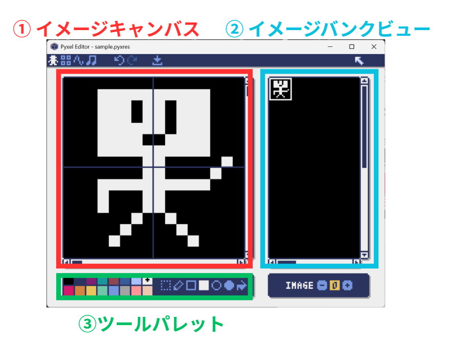
    <br>
    <table>
        <tr>
            <td>
              <div>名前</div>
            </td>
            <td>
              <div>役割</div>
            </td>
        </tr>
        <tr>
            <td>
              <div>①イメージキャンバス</div>
            </td>
            <td>
              <div>実際にドット絵を書くところ</div>
            </td>
        </tr>
        <tr>
            <td>
            <div>②イメージバンクビュー</div>
            </td>
            <td>
              <div>イメージの全体像を表示 <br>実際のドットの大きさで表示される</div>
            </td>
        </tr>
        <tr>
            <td>
            ③ツールパレット
            </td>
            <td>
            色を変えたり、直線や四角形、円を書くためのツールがある
            </td>
        </tr>
    </table>

    右下のボタンは、イメージバンクの番号を切り替えるボタン
    <br>
  - ピクセルエディタの使い方
  
  - <注意>セーブは忘れずに！
    みんなが今使っているvscodeは自動保存になっているのでついつい忘れがちだけど、ピクセルエディタで書いた絵は **保存ボタンを押すか、ctrl + s で保存しないと消えます！**　＼(^o^)／ｵﾜﾀ ってならないように気をつけよう

## pyxel editorで描いた絵を表示させよう

まずは、pyxelプログラムを書くための雛形を書いちゃおう。コピペOK。
```python
import pyxel


pyxel.init(200, 200)

def update():
    pass

def draw():
    pyxel.cls(0)
    

pyxel.run(update, draw)
```
このコードに、pyxel editorで描いたものを表示させるコードを追加していくよ。
vscodeのエクスプローラにあるcharacter.pyxresというファイルを、pythonファイルで使えるようにしなくちゃいけない（ロード）

```python
pyxel.load("character.pyxres")
```

そして、この絵を表示する処理を、draw()関数の中に描いていくんだけど、その時に
- どの画像を表示するか（イメージバンクの何番目の画像を表示するか）
- 画像のどの部分を表示するか（画像の座標）
- 画面のどこ（座標）に表示するか
- 透過（透明）にしたい色
を、正しくdraw関数に伝えてあげる必要がある。

関数にデータを渡してあげるには、 **引数** っていうやつを使えばいいんだったね。ｘが１０、ｙが１０のところに、キャラクターを表示してみよう。

```python
import pyxel

pyxel.init(200, 200)
# character.pyxresファイルをロード(読み込み)
pyxel.load("character.pyxres")
def update():
    pass

def draw():
    # 画面上の（10, 10）の座標に、イメージバンクの0番目の画像のx＝０，　ｙ＝０の位置から、16x16ピクセルで表示
    pyxel.blt(10, 10, 0, 0, 0, 16, 16)

pyxel.run(update, draw)
```
できたら実行してみよう
<br>
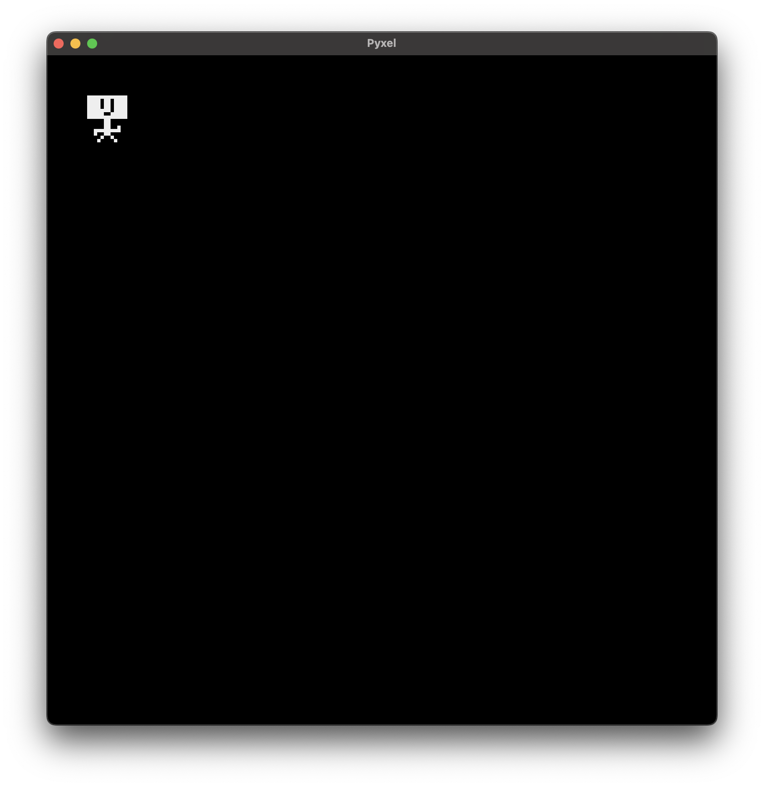
<br>

## キャラクターを動かしてみよう。
さて、↑のコードとにらめっこしてみよう。
```python
import pyxel

pyxel.init(200, 200)
# character.pyxresファイルをロード(読み込み)
pyxel.load("character.pyxres")
def update():
    pass

def draw():
    # 画面上の（10, 10）の座標に、イメージバンクの0番目の画像のx＝０，　ｙ＝０の位置から、16x16ピクセルで表示
    pyxel.blt(10, 10, 0, 0, 0, 16, 16)

pyxel.run(update, draw)
```
このコードで、キャラクターのｘ座標＝横位置を決めているのはこの部分。ここの数字を変えることができれば、キャラクターを動かすことができそう。

プログラム実行中にキャラクターのステータスとか位置情報とかを変更するには、 **update**関数を使うんだったね。
まず、update関数で変更する用の変数を辞書型で用意して、そのデータのなかからx座標の数値をupdate関数で変更するようにしよう。

```python
import pyxel

character_info = {
    "x": 10
}

pyxel.init(200, 200)
# character.pyxresファイルをロード(読み込み)
pyxel.load("character.pyxres")
def update():
    character_info["x"] = character_info["x"] + 1

def draw():
    # 画面上の（10, 10）の座標に、イメージバンクの0番目の画像のx＝０，　ｙ＝０の位置から、16x16ピクセルで表示
    pyxel.blt(10, 10, 0, 0, 0, 16, 16)

pyxel.run(update, draw)
```

さて、どうなるか。

