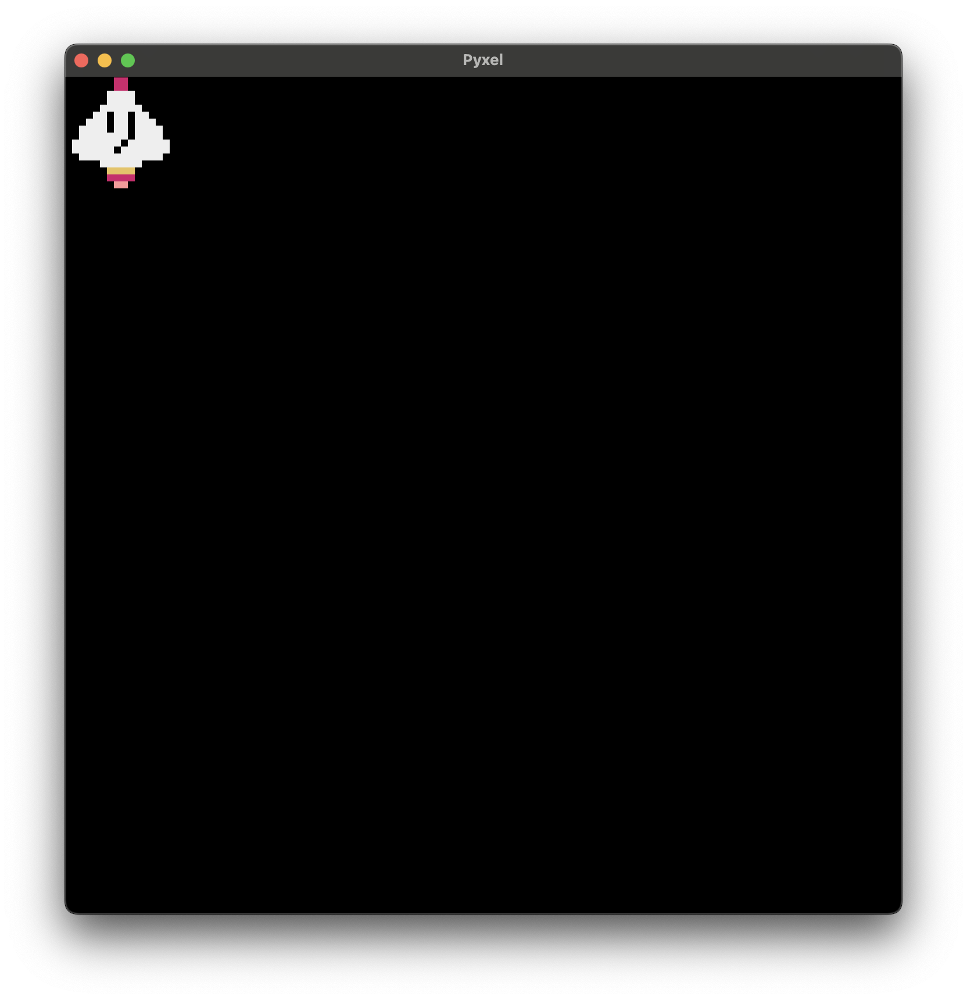
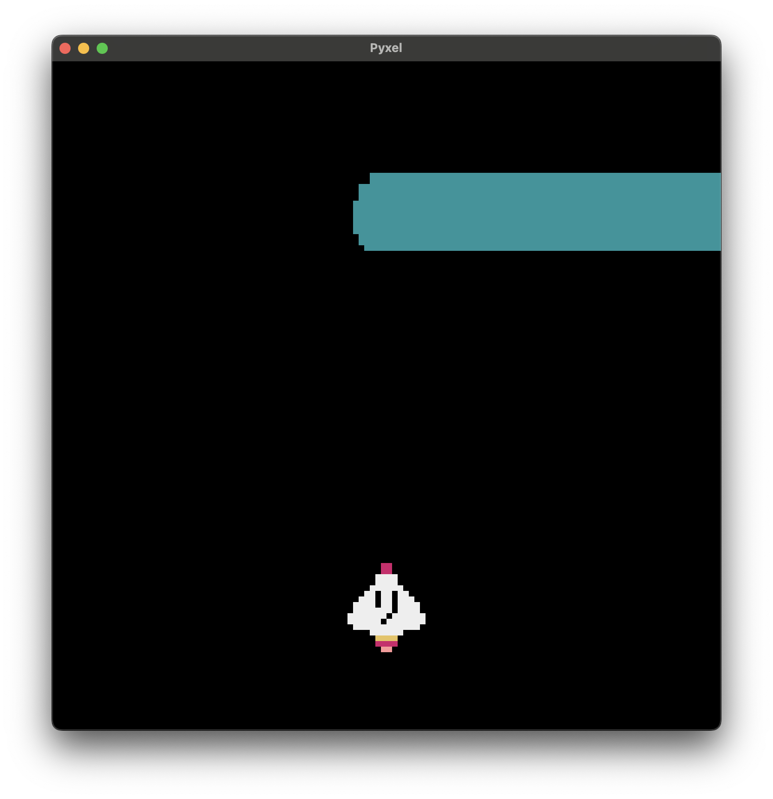
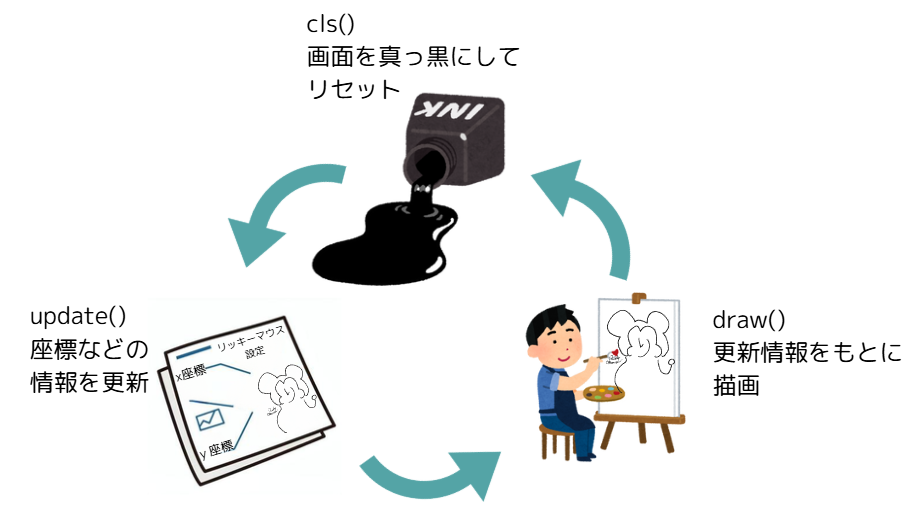

# 弾幕ゲームを作ろう
## 弾幕ゲームとは？
弾幕ゲームは、キャラクターに対して発射される弾を避けまくるゲーム。弾の早さやタイミングを変えることで、ギリギリで避ける爽快感やクリアの達成感を楽しむゲーム。古くはインベーダーゲームとかのファミコン系のゲームもあり、作りやすさやオリジナリティの出しやすさもあって、よくインディーズ（メジャーじゃない、個人開発などの）ゲームで今でも多数のものが作られているジャンル。

今回はpyxelを使って、弾幕ゲームの基本を作っていくよ

## アプリの設計を考えてみる
  何も考えずにいきなりpythonを書き始めるのは、あんまり良くないとされている。みんなも英作文の宿題とかで、いきなり英語で文章を考えるより、まず日本語で何を言いたいかを整理して、どんな単語や文法を使うかを考えてから英文を作ったほうが効率が良かったりするので、どんな感じでコードを描いていくのか、どんな機能を使って作っていくのかを先に考えておこう。


  ### アプリに必要なものを考えてみよう
  プログラミングの勉強として、なにかアプリを作り始めるときに、「自分の実力でできるか」を考えないで、「こんなアプリができたらいいな」を考えるのがコツ。なんでかっていうと、それが一番楽しいから！アプリを作る順番として

  ①「こんなことできたらいいな！」をふんだん詰め込んだ「ぼくがかんがえたさいきょうのアプリ」を考える。
  ②アプリに必要なものを考える
  ③その中から、「最低限」のものを考える
  ④まずは最低限のものを作ってみる
  ⑤うまくいったら、機能を付け加えていく

  - ゲームの見た目的に必要なもの（必須）
    1. 操作キャラ（自分）のキャラクター画像（必須）
    2. 敵キャラのキャラクター画像（必須）
    3. 敵が撃ってくる弾の画像（必須）
    4. ゲームの背景画像
    5. スタート画面の画像
    その他にも、作り込んで行くと、いろんなものが必要になってくる
  - 音関連
    1. 効果音（当たったとき、ゲームオーバー、）
    2. bgm

  ここまでは、利用者＝プレイヤー視点で必要なこと。では、開発する側として考えなくちゃいけないことはなんだろう？

  - ゲームを動かすのに必要なデータ
    1. 操作キャラ動きに関する情報
      - 操作キャラクターの初期位置
      - 操作キャラクターの移動スピード
      - 操作キャラクターの初期HP
      - 残基数

    2. 敵キャラ動きに関する情報
      - 敵キャラクターの初期位置
      - 敵キャラクターの移動スピード
      - 敵キャラクターの進行方向 
    
    3. 弾に関する情報
      - 弾のスピード
      - 弾のダメージ量

  他にも開発していくうえでいろいろ必要になってくるかもしれないけど、とりあえずこんな感じにしよう💦

  データを考えたあとで必要なのは、そのデータを使って、どんな機能を作っていくか、つまり機能を考えなくちゃいけない。

  - 操作キャラ関連の機能
    1. プレイヤーが右キー（左キー）を押したときに、操作キャラが右、左に動く
    2. 画面外に行こうとしたときに止まる
    3. 弾に当たると、ダメージぶんHPが減る
    4. HPがゼロになったときにゲームオーバー

  - 敵キャラ関連の機能
    1. 一定のスピードで進む
    2. 指定の間隔で弾を発射する

  - ゲームシステムの機能
    1. スタート画面をクリックするとゲームスタート
    2. ゲームオーバーになったら処理を停止
    3. ゲームオーバー画面で特定のキーを押したらスタート画面に戻る

## まずは初期画面を表示
pyxelの準備をしよう。
今回はパソコンにpyxelがインストール済みだから、インストール作業は必要なし。

- ### ① pythonファイルを用意しよう
  作業をしたいフォルダに移動したら、まずはpythonファイルを作成しよう。今回はdanmaku.pyという名前にするよ。

  ここに、pyxelの初期コードをコピペしよう。
  ```python
  import pyxel
  pyxel.init(120, 120)
  pyxel.load("danmaku.pyxres")


  def update():
      pass
  def draw():
      pass
  pyxel.run(update, draw)
  ```

  これを実行して、黒い四角が出てきたらOK


- ### ②デザインファイル（pyxresファイル）を用意
  次に、キャラクターデザインとかをするためのpyxresファイルを用意するよ。

  今回はこちらで用意したデザイン用のファイル（pyxresファイル）を共有フォルダから自分のプロジェクトにコピーして使います。

  <details markdown="1">

    <summary>自分でpyxresファイルを作成する場合</summary>
    ターミナルに次のコマンドを打ってみよう

    ```
    pyxel edit　danmaku.pyxres
    ```
    実行すると、pyxel editorというお絵かき＋作曲ツールが出てくるので。　**一度保存してから**　画面を閉じよう。一度保存することで、danmaku.pyxres.pyxresというファイルができて、このファイルがゲームのデザインとか音楽を担当するファイルになる。
    
  </details>

## 操作キャラクターを初期位置に表示しよう
- ### とりあえず表示してみよう
  まず、ターミナルでこのコマンドを打って、どんな画像がデザインファイルに入っているかを確認しよう。
  ```
  pyxel edit　danmaku.pyxres
  ```
  表示したいメインキャラクター派、イメージバンク０番の、（0, 0）から（16, 16）のところにある。
  pyxelでイメージバンクの絵を表示させたい場合は、`blt` という関数を使えばOK。取り合えすこのコードを、表示を担当するdraw()関数の中に書いてみよう
  ```python
  draw():
      pyxel.blt(0, 0, 0, 0, 0, 16, 16, 0)
  ```
  できた
  ただ、ゲーム開始時にこんな左端にいたら、ちょっと妙だよね。<br>
  
- ### 正しい位置に表示しよう
  今回は上から敵が弾幕を撃ってくるようにしたいので、キャラクターは下の方の真ん中に配置して、左右に動いて弾を避けるようにしよう
  表示位置を変更するためには。さっき書いたblt（）関数の`引数`を変更する必要がある。引数は、今回のコードでいうとこの部分。めっちゃある。
  この関数の場合、引数にはこんな感じで順番と役割が決まっている。
  今回のばあい、`表示位置のXを担当するのが１番目` `Yを担当するのが２番目`の引数で、ｘが０，ｙが０のところに表示してね、となってるから、そこに画像の左上を合わせた形で表示されたわけ。
  じゃあ、それぞれの引数を合わせて位置を調整してみよう。
  - #### まずは縦から合わせてみよう。
    下の方に合わせたいので、Y方向に９０のところに合わせよう
    ```python
    def draw():
        pyxel.blt(0, 90, 0, 0, 0, 16, 16, 0)
    pyxel.run(update, draw)
    ```
    できた。
    さて、あとは横方向に真ん中に合わせるだけ。余裕だぜ！
  
  - #### 横のど真ん中に配置しよう
    今回のアプリの縦幅、横幅は、コードのここで書いてあるとおり、１２０ピクセル
    ```python
    pyxle.init(120, 120)
    ```
    てことは、真ん中に置きたいんだから、１２０の半分のところに置けばいい＝割り算すればいいわけじゃんｗｗ俺天才ｗｗｗｗ
    ```python
    def draw():
        pyxel.blt(120 / 2, 90, 0, 0, 0, 16, 16, 0)
    pyxel.run(update, draw)
    ```
    ん〜。。。<br>
    
    。。。なんかズレてね？？
    <details>
    <summary>ど真ん中にする方法</summary>
    答え書いてあると思った？？？ｗｗｗｗ残念ｗｗｗｗｗｗ<br>
    考えてみよう
    </details>
  - #### 敵キャラも上のど真ん中に表示しよう
    やってみよう
- ## 動かしてみよう！
  - ### ①位置情報を変数にまとめよう
    さっき書いたblt関数の１つ目、２つ目の引数を、アニメーションのフレームごとに変えていければ、キャラクターを動かすことができそうな気がする。
    となると、blt関数を使うときに常に「キャラクターのｘ座標・ｙ座標」にアクセスできるようにしておくのが便利。
    いろんな方法があるけど、今回は`辞書型`のデータを作って、変数としていつでも呼び出せるようにする方法を使っていくよ
    辞書型の復習をしておこう。リッキーの情報を辞書型にしてみるとこんな感じ
    ```python
    ricky_information = {
        "age": 37,
        "gender": "男",
        "hobby": "プログラミング"
    }
    # 呼び出すとき
    print(ricky["age"])
    ```

    こんな感じで、キャラクターの情報をまとめておこう。そういやキャラの名前を決めてなかったので。操作キャラをcharacter, 敵キャラをenemyとしよう

    ```python
    character = {
        "x": 120 / 2 - 16 / 2,
        "y": 90
    }
    enemy = {
        "x": 120 / 2 - 16 / 2,
        "y": 20
    }
    ```


    せっかく辞書型にまとまったので、draw関数で表示する部分で、この変数を使うように変更しよう。
    現時点での全体のコードはこんな感じ
    ```python 
    import pyxel
    pyxel.init(120, 120)
    pyxel.load("danmaku.pyxres")

    character = {
        "x": 120 / 2 - 16 / 2,
        "y": 90
    }
    enemy = {
        "x": 120 / 2 - 16 / 2,
        "y": 20
    }

    def update():
        pass
    def draw():
        pyxel.blt(character["x"], character["y"], 0, 0, 0, 16, 16, 0)
        pyxel.blt(enemy["x"], enemy["y"], 0, 16, 0, 16, 16, 0)

    pyxel.run(update, draw)
    ```

  - ### ②Xの情報を更新（UPDATE）してみよう
    さっき宣言した辞書型の「ｘ」の数字を増やしたり減らしたりすれば、ゲーム内で動かすことができそう。
    pyxelで、情報の更新を担当する関数は `update`関数だったね。
    敵キャラを動かすから、enemyのXを変えていこう
    ｘの数字を１増やすコードを、update 関数の中に勝てみよう
    ```python
    import pyxel
    pyxel.init(120, 120)
    pyxel.load("danmaku.pyxres")

    character = {
        "x": 120 / 2 - 16 / 2,
        "y": 90
    }
    enemy = {
        "x": 120 / 2 - 16 / 2,
        "y": 20
    }

    def update():
        enemy["x"] = enemy["x"] + 1
        
    def draw():
        pyxel.blt(character["x"], character["y"], 0, 0, 0, 16, 16, 0)
        pyxel.blt(enemy["x"], enemy["y"], 0, 16, 0, 16, 16, 0)

    pyxel.run(update, draw)
    
    ```
    <br>
    **なんかのびたんだがｗｗｗｗ**
    ここでちょっとpyxleの描画＝イラストなどを表示する仕組みについて説明するよ
    draw関数というのを使ってキャラクターを表示しているけど、実はこの関数、すでにある絵に絵を書き足しているだけだから、キャラクターの位置を変えて絵を書き足していくと、さっきみたいなことになる。<br>
    
    そこで、draw関数で絵を書き足す前に。一度画面をリセットして、キャラクターを描き直すと、キャラクターが移動しているように見える。

    `pyxle.cls(0)`という一文を加えることで、こんな感じで移動するアニメーションができるよ。ちなみに、0は0番目のカラーコード、つまり黒のこと。
    イメージ的には、絵を書いて、そこにインクをぶちまけて、その上に新た敷く絵を書いて、って感じ。
    ```python
    import pyxel
    pyxel.init(120, 120)
    pyxel.load("danmaku.pyxres")

    character = {
        "x": 120 / 2 - 16 / 2,
        "y": 90
    }
    enemy = {
        "x": 120 / 2 - 16 / 2,
        "y": 20
    }

    def update():
        enemy["x"] = enemy["x"] + 1

    def draw():
        pyxel.cls(0)
        pyxel.blt(character["x"], character["y"], 0, 0, 0, 16, 16, 0)
        pyxel.blt(enemy["x"], enemy["y"], 0, 16, 0, 16, 16, 0)

    pyxel.run(update, draw)

    ```
  - ### 画面外に消えちゃう問題
    さてどうする？
    画面外に行くってことはどういうことか考えてみると
    `敵キャラのx座標が大きくなりすぎ！`
    って言えるから、それをなんとかすればよさげ。
    もっというと
    `敵キャラのx軸が〇〇より小さいときは移動する　そうじゃないときは移動しない`
    ってすれば、行けそうな気がする！<br>
    もっともっというと、
    `＜もし＞敵キャラのx軸が〇〇より小さいときは移動する　＜そうじゃないとき＞は移動しない`<br>
    もうひとこえ！
    ```python
    if 敵キャラのｘ座標が120より小さいとき:
        character["x"] = character["x"] + 1
    else:
        移動しない
    ```

    行ったれ！！！
    ```python
    def update()
        if enemy["x"] < 120 - 16:
            enemy["x"] = enemy["x"] + 1
            print(enemy["x"])
        else:
            pass
    ```
  - ### 止まったのはいいけどさ
    これ、どうするよ
    ちょっと設計を変えて、こんな感じ、左右に敵キャラが動くようにしよう。
    - 右側の壁に到達したときに、進行方向を右から左にする
    - 左の壁に到達したとき、進行方向を左から右にする
  
    これを実現する耐えには、`進行方向`を示す変数を設定する必要があるんだけど、どういうデータにしようか。

    右のときは＋１にして、左のときは−１にして、右のときは＋１にして、左のときは−１にして
    このとき、右から左、左から右のときにやってる共通したことってなんだろう？
    そう、`-1`をかければいい！

    コードに起こしてみると、こうなる！
    ```python
    def update():
        enemy["x"] = enemy["x"] + enemy["direction"]
        if enemy["x"] >= 120 - 16 or enemy["x"] <= 16:
            enemy["direction"] = enemy["direction"] * -1
    ```
    
- ## キーボード操作で動かしてみよう。
敵キャラを動かすのは自動操作でできたけど、操作キャラクターを勝手に操作されるのは困るので、キーボード入力がされているときに、そのキーに応じた方向に移動するようにしたい。
具体的には
<table>
    <tr>
        <td>キー
        </td>
        <td>移動方向
        </td>
    </tr>
    <tr>
        <td>右矢印（→）
        </td>
        <td>ｘ軸方向に＋
        </td>
    </tr>
    <tr>
        <td>左矢印（←）
        </td>
        <td>x軸方向にー
        </td>
    </tr>
</table>

移動の部分は敵キャラの移動の応用をすればいけそう。
問題はキー入力の部分。pyxelでは、キーごとに変数名が決まっていて、キーが押されているときはその変数に`True`が入る（＝そうじゃないときはFalse）が入る。それを利用して<br>
```
if キーが押されたかどうか== True:
    押されたときにやりたいこと
```
って感じにすればOK。
今回はキーボードの矢印キーを検知したいので、使うのはこの４つだけ
<table>
    <tr>
        <td>
          pyxel.KEY_RIGHT
        </td>
        <td>
          右矢印
        </td>
    </tr>
    <tr>
        <td>
          pyxel.KEY_LEFT
        </td>
        <td>
          左矢印
        </td>
    </tr>
    <tr>
        <td>
          pyxel.KEY_UP
        </td>
        <td>
          上矢印
        </td>
    </tr>
    <tr>
        <td>
          pyxel.KEY_DOWN
        </td>
        <td>
          下矢印
        </td>
    </tr>
</table>
じゃあ、右矢印が 押されたときに、キャラクターを右（ｘ方向）に１移動するコードを書いてみよう

```python
  if pyxel.btn(pyxel.KEY_RIGHT) == True:
      character["x"] = character["x"] + 1
      
  elif pyxel.btn(pyxel.KEY_LEFT) == True:
      character["x"] = character["x"] - 1
```


    


  

  
  


    


