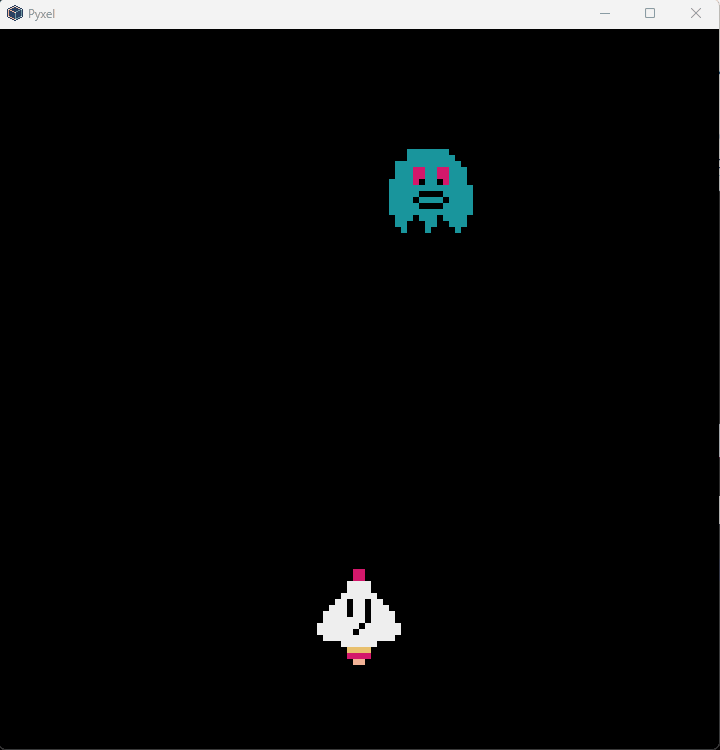
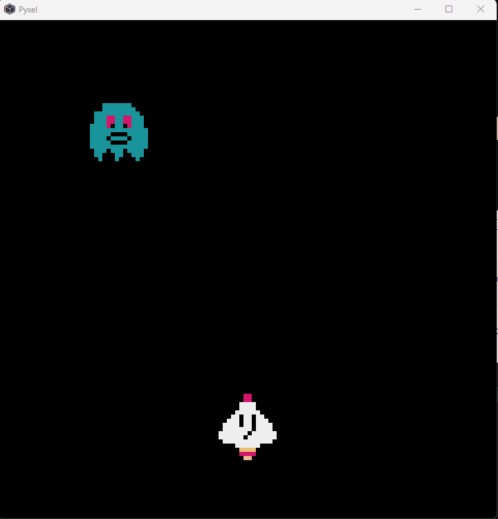
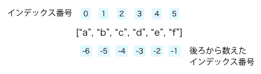
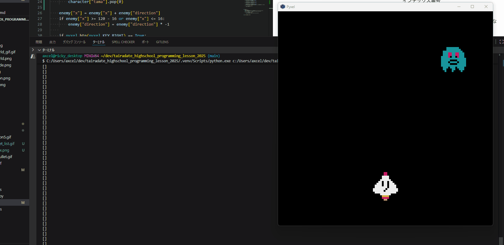
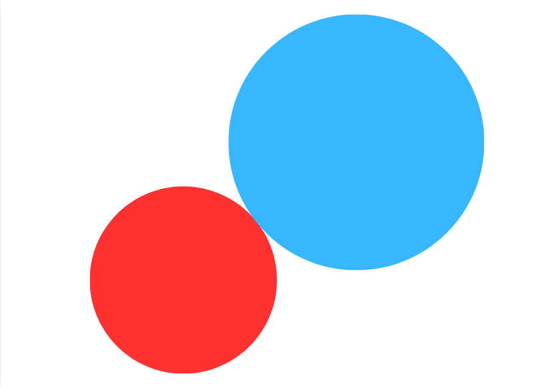
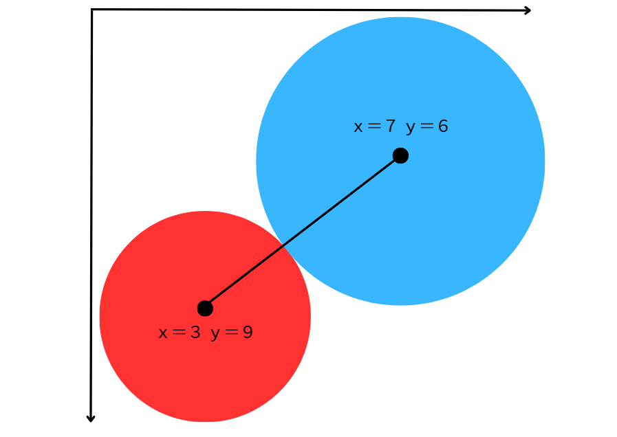

# 弾を出そう
弾を発射するためには、いくつかやらなくちゃいけないことがあるけど、とりあえず弾を表示するだけのコードを書いてみよう

弾はシンプルに、pyxel の機能でできる四角形を使おう。
スペースキーが押されたときに、黄色い資格がキャラクターの上に表示されるようにしてみよう。

```python
import pyxel
pyxel.init(120, 120)
pyxel.load("danmaku.pyxres")

character = {
    "x": 120 / 2 - 16 / 2,
    "y": 90,
    "tama": []
}
enemy = {
    "x": 120 / 2 - 16 / 2,
    "y": 20,
    "direction": 1
}

    


def update():
    print(character["tama"])
    enemy["x"] = enemy["x"] + enemy["direction"]
    if enemy["x"] >= 120 - 16 or enemy["x"] <= 16:
        enemy["direction"] = enemy["direction"] * -1
    
    if pyxel.btn(pyxel.KEY_RIGHT) == True:
        character["x"] = character["x"] + 1
        
    elif pyxel.btn(pyxel.KEY_LEFT) == True:
        character["x"] = character["x"] - 1

    if pyxel.btnp(pyxel.KEY_SPACE) == True:
       character["tama"].append([character["x"], character["y"] - 16])
    
    


def draw():
    pyxel.cls(0)
    pyxel.blt(character["x"], character["y"], 0, 0, 0, 16, 16, 0)
    pyxel.blt(enemy["x"], enemy["y"], 0, 16, 0, 16, 16, 0)
    
    for i in character["tama"]:
        pyxel.blt(i[0], i[1], 0, 32, 0, 16, 16, 0)
    
pyxel.run(update, draw)
```
<br>

弾を動かすために、[tama]の中にある弾丸を、ｙ方向に１づつ移動させよう。この処理をupdate関数の中に追加します

```python
for i in character["tama"]:
    i[1] = i[1] - 1
```
<br>
これで、ゲームっぽくなってきた！！<br>
<br>

# 弾を消そう
今ターミナルを見てみると、めちゃくちゃ文字が文字がたくさん出ていて、何がなんだかって感じになってる

<br>

うん、キモい。
これは、update()関数の一番最初に
```python
print(character["tama"])
```
が入っているからなんだけど。tamaリスト、つまり弾丸の座標のリストが、弾を打つたびに増えていってるから。
見て分かる通り、弾が画面外に出たあとも表示されているし、数字が変わっているね。表示場はうまくいってても、裏側では、もう画面上ん存在しない弾の処理を、プログラムが捺せられている状態。
「うまくいってるんだからいいじゃん」って言ってこれを放置しておくと、例えばゲーム後半で処理が重くなって、ゲームのw動作が不安定になったり、思わぬところでバグが発生したりして、大変なことになりかねない。
じゃあ、必要のない弾を消してしまおう。
弾を消すには、必要ない座標のリストを`tamaリスト`から消してしまえばいいんだけど、どういう条件で弾を消すかを先に考えよう。
- ①画面外に出た弾を消す
- ②敵キャラに当たった弾を消す

この２つを、順番に実装していこう。

  - # 画面外に出た弾を消す
    敵に当たらずに画面外に出るケースを実装しよう。
    画面外に出るということはどういうことか。ｙ方向に移動しているわけだから、弾の座標が -16 になったら画面外に出る。そうなったら用済みなので、弾を消しちゃおう。
    つまり、tamaリストの中から、ｙ軸の数字が -16 以下になっているやつを探して、そいつを削除すればいいわけだ。
    ### リストの性質：先入れ先出し
    tamaリストは、pythonのデータ型の一つ、「リスト」というデータになっている。データを纏めて保存するのに便利な型なんだけど、いくつか特徴がある <br>
    <br><br>
    今回の場合、右側（後ろの方）にデータを追加していってるので、一番古いデータは一番左になる。
    pyxelは毎フレームごとに処理を実行するわけだから、例えば同じフレームで弾が２発打ててしまうことはあり得ない。つまり、毎回tamaリストにある全部の座標をチェックする必要はなくて、一番古いデータをチェックして、座標が-16以下になっていればそれを消す、って感じでOKなわけ。それを実装すると、こんな感じになる

    ```python
    # 一番古い弾のデータをチェック
    if len(character["tama"]) and  character["tama"][0][1] <= -16:
        character["tama"].pop(0)
    ```
    `pop`ていうのがリストから消す働きをしているんだけど、リストの詳しいことなどは今回は深く突っ込まないので、気になる人はリッキーたちに聞いてくれ♪
    <br>
    弾が消えてるかどうか、実行して確認してみよう
    <br><br>
    これでおｋ！

  - # 敵に当たった弾を消す
    さて、この仕組みを考えよう
    ### 当たり判定 
    格ゲーとかシューティングゲームにおいて、このあたり判定がうまく調整されているかどうかは、そのゲームが神ゲーになるかクソゲーになるかの大きな決め手。
    いろいろな方法があるけど、今回はそのうちの一つを紹介します。
    <br>
    ちょっと考えてみよう。半径２センチの円と、３センチの円があったとしよう。この２つが当たっているかどうかを判定する条件はなんだろう？
    <br><br>
    そう、中心同士の距離が２＋３＝４センチ以下かどうか、だよね。
    そのとおりなんだけど、pyxelの画面では、こんな感じのｘ座標、ｙ座標で、キャラクターや物体の場所が表される。この２つが当たってるかどうか、どうやって判定する？<br>
    <br><br>

    ### みんな大好き数学の時間だぜ
    三平方の定理を思い出してみよう。
    こういう三角形をおいてみると、円の中心同士の距離がわかる
    <br><br>
    ？の部分を求めるには
    ```
    ？の２乗 ＝ ４の２乗 ｘ ３の２乗
    ```
    なので、？は５。つまり、当たっとるやないかい！ってこと
    すごいぜ数学！！数学大好き！！！

    当たり判定について、ストリートファイター開発者の人がより詳しいことを解説しているので、読んでみて
    [ストゼミ：当たり判定の基本](https://game.capcom.com/cfn/sfv/column/130393)

    <br>
    さてさて、では実装してみよう。。。と行きたいところだけど、今回はコピペでゆるしてやろう（謎の上から目線）

    あれ？当たり判定おかしくね？ってなった人、なんでだかわかる？
    今回、弾の形がめっちゃ細長いよね。これだと、中心同士の距離で当たり判定をつけると、こんな感じになる。
    みんなが「なんだよこのクソゲー金返せ！」って言っている裏では、こういうところでプログラマーさんが血の滲む努力をしていたりするわけです。。。


